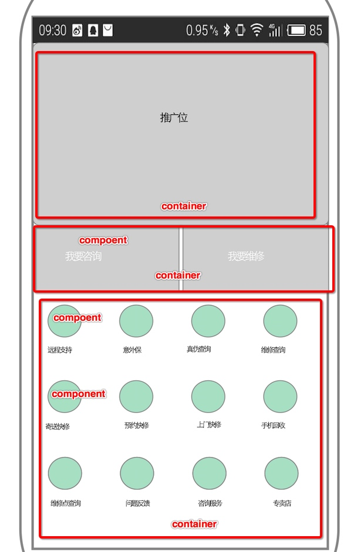

# mCare 服务器端需求

1. 主页板块 A、B、C
2. 常见问题
3. 24小时客服菜单
4. 售后政策服务  mkdoc
5. 报价服务，报价信息列表

## 自定义服务接口平台
###  接口特点
1. 不需要登录
2. 无规律，分散
3. 访问路径一般为异步

### 实现方式
#### 站点
1. 多站点服务系统 SaaS
2. 为每个站点配置后台管理页面
3. 站点拥有一个所有者，且不能修改。
4. 用户可以拥有多个站点管理权限、一个站点也可以拥有多个管理者

### 后台的功能
#### 登录逻辑
1. 在数据库添加信任用户的邮箱
2. 输入邮箱--点击登录 【登录页面】
3. 发送邮件
4. 点击邮件里面的 url 按钮，完成登录

#### 站点管理
1. 如果用户没有站点，则引导到新建站点页面
2. 新建站点
3. 列出站点管理的菜单栏
    1. 站点信息管理，只能新建一次
    2. Ship 管理
    3. Container 管理
    4. Component 管理

#### 管理的注意事项
1. data 为 JSON 对象
2. canDelete 如果为 false， 则不出现删除按钮。
3. 在列表页，显示该 model 的前端 api 接口。


## 服务器接口架构

##### 关系
1. Ship 包括多个 Container，Container 包含多个 Component。
2. Ship 必须包含Container 才能提供访问路径
3. Container 必须包含 Component 才能提供访问路径
4. Component 才能提供访问路径

##### 组件 Model
1. Ship 船——页面
    * uuid
    * title
    * domain
    * description
    * data [JSON] 其他额外数据
    * publish [true | false]是否发布
    * images [Array] 图片数组
    * expire [second] 过期时间
    * Site 站点
2. Container 集装箱——板块
    * site
    * uuid
    * title
    * domain
    * description
    * data [JSON] 其他额外数据
    * publish [true | false]是否发布
    * weight 排序权重，越大越靠前
    * images [Array] 图片数组
    * expire [second] 过期时间
    * Ship [Null default] 可以属于某个船
    * Site 站点
3. Component 组件——元素
    * uuid
    * title
    * domain
    * description
    * data [JSON] 其他额外数据
    * publish [true | false]是否发布
    * weight 排序权重，越大越靠前
    * images [Array] 图片数组
    * expire [second] 过期时间
    * proxy 代理请求 格式为 url。 需要的数据并不在此Component，需要服务器端代理去请求 这个 proxy url
    * Container [Null default] 可以属于某个集装箱
    * Site 站点

##### 访问
1. /:site/[ship | container | component]/:uuid
2. /:site/[ship | container | component]/:domain
3. uuid 为全局唯一， domain 为 site 唯一。默认 uuid == domain
4. 每个接口都可以单独设置缓存时间


### SSCC site+ship+container+component 数据格式
1. wan
2. lifekit
3. mcare





#### Component 组件，即具体配置




```
{
  "title": "我是某一个菜单项",
  "domain": "image1",
  "weight": 100,
  "container": 1,
  "uuid": "f8b5feff-203d-42cd-bab7-871070ef46fb",
  "publish": true,
  "expire": 0,
  "createdAt": "2016-06-28T06:21:24.961Z",
  "updatedAt": "2016-06-28T06:21:24.961Z",
  "id": 2
}
```

#### Container 容器，组件集合




```
{
  "uuid": "e1aa3b18-2473-4455-a997-bb2d4682cf45",
  "title": "主页推广位",
  "domain": "index1",
  "cover": null,
  "description": null,
  "publish": true,
  "expire": 0,
  "weight": 0,
  "images": null,
  "data": null,
  "id": 1,
  "createdAt": "2016-06-28T06:07:48.000Z",
  "updatedAt": "2016-06-28T06:07:48.000Z"
}
```

##### 1.容器下面的所有组件
 url : `/api/site/:site/container/[uuid | domain]`

```
[
  { Component1 },
  { Component2 },
  ....
]
```

##### 2. 请求组件

 url : `/api/site/:site/component/[uuid | domain]`


```
```
##### 3. 多个容器信息
 `/api/site/:site/ship/[uuid | domain]`

例如：主页包含三个板块（container）。同时请求三个板块的信息返回如下:

```
{
  containerDomain1: [component],
  containerDomain2: [component],
  ...
}
```

##### 4. 某容器下的组件模糊搜索
`/api/site/:site/container/[uuid | domain]/search?keyword=:keyword`

```
[
  { Component1 },
  { Component2 },
  ....
]
```
