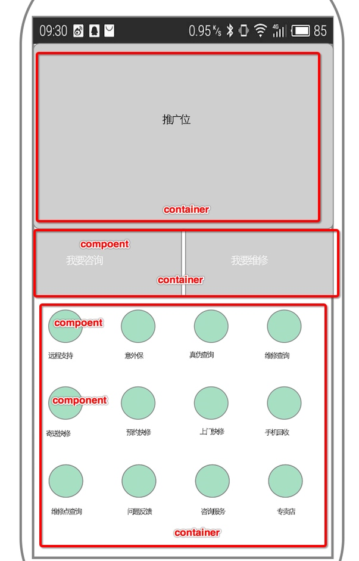

# API-Master 接口大师
> 为多个系统提供相似数据类型的接口服务平台。

## 使用场景
1. 项目组需要开发和维护多个 APP 项目，APP 项目都会有菜单管理、导航栏管理，启动页管理，或者首页等等。
2. 组件数据接口（Component）。各种配置需要的数据类型通用字段有：标题、图片、链接、Action、其他自定义的数据类型。

    ```
    {
        title: String,
        image: String,
        url: String,
        data: JSON
    }
    ```
3. 列表数据接口（Container）。多个菜单项组合在一起，被称之为列表。
4. 页面数据接口 (Ship 或者 Page)。多个列表数据类型或者多个组件数据类型组合。



## 项目定义
> Site + Ship + Container + Component
一个站点下面可以有很多的轮船（Ship），每个轮船可以放很多集装箱（Container）,集装箱里面可以放很多的货物（Component），Component 可以自定义，就是说你可以放任意的货物。这种模型就可以满足绝大多数的系统配置要求。

对应关系:
* Site ————> 站点
* Ship ————> 页面
* Container ————> 模块
* Component ————> 组件

如果你乐意，你可以配置任意多个站点，满足你的各种项目需求。

## Model
#### Component 组件，即具体配置

```
{
  "title": "我是某一个菜单项",
  "domain": "image1",
  "weight": 100,
  "container": 1,
  "uuid": "f8b5feff-203d-42cd-bab7-871070ef46fb",
  "publish": true,
  "expire": 0,
  "createdAt": "2016-06-28T06:21:24.961Z",
  "updatedAt": "2016-06-28T06:21:24.961Z",
  "id": 2
}
```
#### Container 容器，组件集合

```
{
  "uuid": "e1aa3b18-2473-4455-a997-bb2d4682cf45",
  "title": "主页推广位",
  "domain": "index1",
  "cover": null,
  "description": null,
  "publish": true,
  "expire": 0,
  "weight": 0,
  "images": null,
  "data": {JSON Object},
  "id": 1,
  "createdAt": "2016-06-28T06:07:48.000Z",
  "updatedAt": "2016-06-28T06:07:48.000Z"
}
```

## 接口
### 1.组件列表
* url : `/api2/:site/container/[uuid | domain]`
* example：`/api2/mcare/container/menus`

```
    [
        { Component1 },
        { Component2 },
        ....
    ]
```

### 2. 组件

* url : `/api2/:site/component/[uuid | domain]`
* emample: `/api2/mcare/component/support`

```
    {Component}
```
### 3. 整个页面的数据
* url：`/api2/:site/ship/[uuid | domain]`

* example： `/api2/mcare/ship/index`

例如：主页包含三个板块（container）。同时请求三个板块的信息返回如下:

```
{
  containerDomain1: [component],
  containerDomain2: [component],
  ...
}
```

### 4. 组件模糊搜索
* url：`/api/site/:site/container/[uuid | domain]/search?keyword=:keyword`

* example：`/api2/mcare/container/issus/search?keyword=Home键失效

```
[
  { Component1 },
  { Component2 },
  ....
]
```

